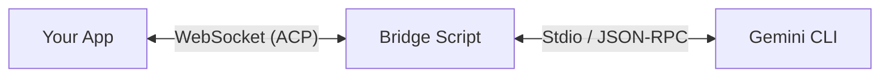

# Agent Chat SDK

A TypeScript client library for building chat applications powered by Google's Gemini CLI Agent. This SDK provides a robust WebSocket-based transport layer to communicate with the Gemini CLI via an intermediate bridge.

## Features

- **Robust WebSocket Transport**: Handles connection stability and message framing.
- **Agent Chat & Logic**: Encapsulates the ACP (Agent Chat Protocol) for seamless agent interaction.
- **Tool Support**: Built-in parsing for tool calls, including "Permission" and "User Interaction" extensions.
- **Real-time Streaming**: Event-based architecture for streaming thoughts, text, and tool status updates.
- **UI State Store**: Optional store with subscribe/getState for GUI state binding.
- **UI Events**: Standardized, UI-friendly events for rendering.
- **Resilient Parsing**: Custom logic to handle Gemini CLI's specific output formats (e.g., recovering tool descriptions from titles).
- **Diff Formatting**: Tool `diff` updates are converted into unified diff strings for efficient UI display.

## Installation

```bash
npm install @yohaku/agent-chat-sdk
```

## Quick Start

### 1. Start the Bridge

The SDK requires a bridge process to communicate with the Gemini CLI binary.

```bash
# Start the bridge on port 4444 (default)
npm run start:bridge
```

### 2. Use the Client

```typescript
import { AgentChatClient } from '@yohaku/agent-chat-sdk';

const client = new AgentChatClient({
    url: 'ws://localhost:4444',
    channel: 'chat-v1',
    diffContextLines: 3
});

// Listen for updates
client.on('text_delta', (evt) => {
    process.stdout.write(evt.delta);
});

client.on('tool_update', (evt) => {
    console.log(`[Tool] ${evt.toolCall.name}: ${evt.toolCall.status}`);
});

// Connect and start chatting
await client.connect();
await client.sendMessage('Hello, can you list the files in the current directory?');
```

### 3. UI State Store (Optional)

```typescript
import { AgentChatClient, AgentChatStore } from '@yohaku/agent-chat-sdk';

const client = new AgentChatClient({ url: 'ws://localhost:4444' });
const store = new AgentChatStore(client);

const unsubscribe = store.subscribe((state) => {
    // Bind to UI
    // state.messages, state.isStreaming, state.connectionState, etc
});

await client.connect();
await client.sendMessage('Hello!');
```

### 4. UI Events (Standardized)

These events are added for GUI-friendly integrations (existing events are still emitted):

- `connection_state_changed` → `{ state }`
- `turn_started` → `{ userMessageId }`
- `turn_completed` → `reason`
- `assistant_text_delta` → `{ messageId, delta, text }`
- `assistant_text_final` → `{ messageId, text }`
- `assistant_thought_delta` → `{ messageId, delta, thought }`
- `tool_call_started` → `{ messageId, toolCall }`
- `tool_call_updated` → `{ messageId, toolCall }`
- `tool_call_completed` → `{ messageId, toolCall }`
- `permission_required` → `PendingApproval`
- `auth_required` → `url`

Note: when a tool update includes a diff payload, `toolCall.diff.unified` contains a unified diff string.
You can control the number of context lines with `diffContextLines` in `AgentChatClient` options (default: 3).

## Architecture



## Development

- **Build**: `npm run build`
- **Test CLI**: `npm run start:cli`
- **Bridge**: `npm run start:bridge`

### Approval Mode

The bridge passes `--approval-mode` (default: `default`):

```bash
GEMINI_APPROVAL_MODE=default npm run start:bridge
```
