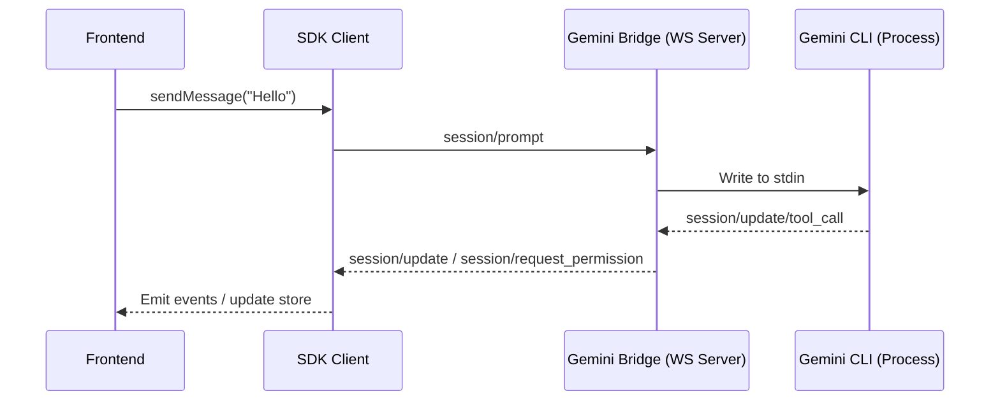

# Gemini ACP SDK Design Specification

## Overview

This document describes the architecture and design goals for the SDK. It is meant to stay aligned with the current implementation.

## Portability & Multi-Environment Support

### 1) Framework-agnostic core

- Core logic (transport, session, parsing, auth/approval handling) lives in `AgentChatClient` and related core modules.
- The core is UI-framework agnostic and works in browsers or Node (with `ws`).

### 2) UI integration

- `AgentChatStore` provides a minimal subscribe/getState interface for React and other UI frameworks.
- Additional framework-specific hooks are **not implemented yet**; they may be added later.

### 3) Distribution

- ESM output in `dist/` for modern bundlers.
- The package exports `client` and `server` entrypoints to keep browser builds clean.

## Tool Execution Approval Flow

- Listens for `session/request_permission`.
- Exposes `pendingApproval` to the UI.
- UI selects an option and calls `approveTool(optionId)`.

## Authentication Flow

- Captures auth URL from the bridge and notifies the UI.
- CLI blocks prompts until `submitAuthCode(code)` is called.

## Configuration & Model Selection

- Bridge can be configured via env vars (`GEMINI_MODEL`, `GEMINI_APPROVAL_MODE`).
- Client can pass `model` in `session/new` if supported by the bridge/CLI.

## Communication Pattern

## Design Principles

- **WebSocket-first**: UI <-> bridge is event-driven, JSON-RPC over WS.
- **Framework-agnostic**: Core logic is independent from UI frameworks.
- **Deterministic rendering**: `content[]` preserves interleaving of text/thought/tool calls.
- **Resilience**: Automatic WS reconnect; robust parsing of tool metadata.
