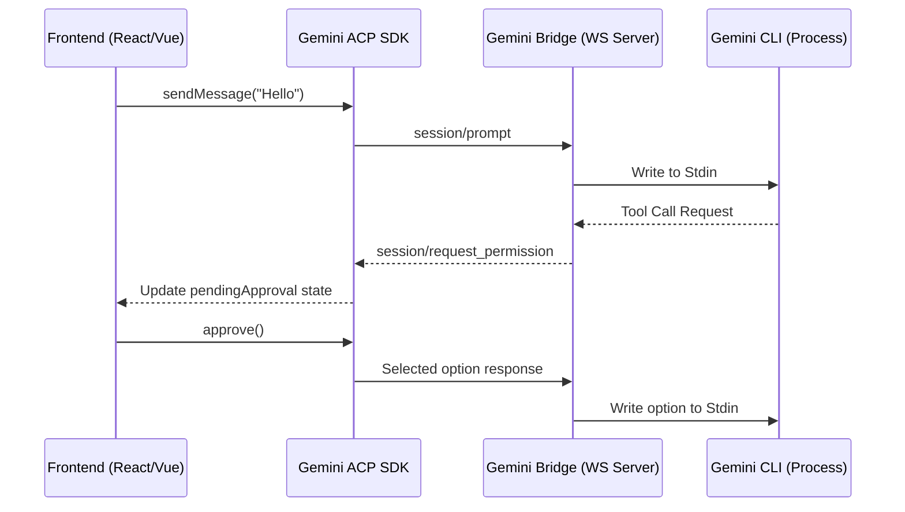

# Gemini ACP SDK Design Specification

## Overview
This document outlines the architecture and design patterns for the Gemini ACP SDK. The goal is to provide a robust, easy-to-use library for integrating Gemini CLI features into Chat UIs and IDEs via WebSocket.

## Portability & Multi-Environment Support
この SDK は、**あらゆる JavaScript/TypeScript 環境**（Web, Node.js, Electron, VSCode 拡張等）で動作するように設計されています。

### 1. Framework-Agnostic Core
- コアロジック（通信、状態管理、認証フロー）は、React や Vue などの特定のフレームワークに依存しない純粋な TypeScript クラス (`AgentChatClient`) として実装されます。
- これにより、CLIツールのバックエンドや、Svelte/SolidJS といった他の UI フレームワークでも再利用可能です。

### 2. UI-Specific Adapters
- React 用の `useGeminiChat` など、各フレームワーク向けのアダプターを `src/ui/` 等に分離して提供します。
- これにより、プロジェクトのスタックに合わせて必要な部分だけをインポートできます。

### 3. Distribution
- **CJS/ESM 両対応**: `dist/` フォルダにモダンな ESM と、レガシー環境向けの CommonJS の両方を出力します。
- **Zero-Dependency (Core)**: コア層の依存関係を最小限に抑え、バンドルサイズを最適化。

### 2. Tool Execution Approval Flow
- **Permission Requests**: Listens for `session/request_permission`.
- **UI State**: Exposes a `pendingApproval` state to the frontend.
- **Response Handling**: Provides methods to `approve()` or `deny()` a specific tool call, sending the corresponding JSON-RPC response back to the bridge.

### 3. Authentication Flow (Google OAuth)
- **Detection**: Captures OAuth URLs from the bridge and notifies the UI.
- **Locking**: Suspends outgoing prompt messages during the authentication sequence.
- **Resolution**: Handles code submission to unlock the input stream.

### 4. Configuration & Model Selection
- **Inputs**: Supports configuration via environment variables (e.g., `GEMINI_MODEL`) and library constructor arguments.
- **Flexibility**: Allows switching models between sessions if supported by the bridge.

## Communication Pattern

## デザインの核となる原則
-   **WebSocket-First**: フロントエンドとバックエンド（ブリッジ）間のリアルタイム・イベント駆動通信を標準化。
-   **Framework-Agnostic**: コアロジックを UI フレームワークから分離し、あらゆる環境での再利用性を確保。
-   **Zero-Config UI**: `useGeminiChat` などのアダプターを通じて、リッチな UI を即座に構築。
-   **Extensibility & Robustness**: 自動再接続や、独自のツールハンドラーの追加が容易。

## Developer Experience (DX) Goals
- **Boilerplate-free**: A single hook (`useGeminiChat`) should handle 90% of chat use cases.
- **Type Safety**: Full TypeScript support for all message types and parameters.
- **Rich Examples**: Provide clear patterns for handling diffs and tool outputs.
